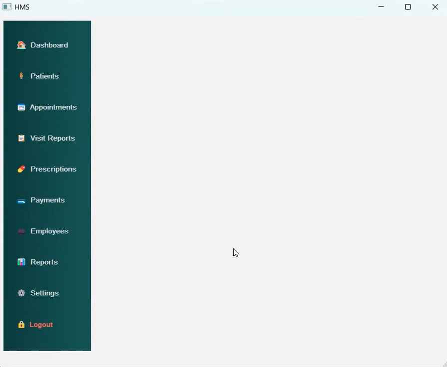

## Hospital Management System (HMS)

A work-in-progress desktop application for managing hospital operations, built with Python (PyQt5) and SQL Server.
Current version focuses on patient management with basic appointment demo; more clinical modules are planned.

Table of Contents

---

## Features

Installation

Usage

Screenshots

Dependencies

Project Structure

Configuration

Roadmap

Known Limitations

Contributing

License

Acknowledgments

---

## Features

🔑 User Authentication (demo): simple login dialog with a seeded admin (admin/admin123) auto-created when the users table is empty. (Plain-text check for testing only.)

👤 Patient Management: add new patients (party→person→patient, transactional insert), edit existing records, and view details.

🔎 In-table Search: quick client-side filter on the loaded patient grid.

📅 Appointment Reservation (demo): one-click example that schedules a visit a few days ahead (hard-coded doctor id for now).

🧱 Database-first design: normalized schema with core entities (parties, persons, users, patients, appointments, …) and an ERD PDF.

---

## Installation

Clone the repo & create a virtual environment (optional but recommended):

git clone https://github.com/mahyarmohammdlou/MedDesk-HMS.git
cd HMS
python -m venv venv
# Windows:
venv\Scripts\activate
# macOS/Linux:
source venv/bin/activate

Install dependencies:

pip install -r requirements.txt

Create database & schema:

Open SQL Server (local or remote).

Execute database/HMS_DB.sql to create tables and seed required objects.

(Windows) Install ODBC driver if needed: ODBC Driver 17 for SQL Server (or newer).

---

## Usage

Run the desktop app:

python app/HMS.py

Log in using the test account (admin / admin123). The login dialog loads from login.ui and seeds the test user automatically if needed.

Go to Patients to view, search, add, edit, or double-click to open a quick view.

Use Reserve to create a demo appointment for the selected patient.

---

## Screenshots

ERD diagram:

Login dialog:

Main Windows:

Add patient:

Show patient:

Show patient list in SQL:

---

## Dependencies

Python 3.9+ (recommended)

PyQt5 for the GUI (Qt Designer .ui files are loaded at runtime)

pyodbc for SQL Server connectivity (see connection string below)

SQL Server (Express or higher)

---

## Project Structure
HMS/
├── app/
│   ├── HMS.py                 # Main window, routing, patients table & actions
│   ├── login.py               # Login dialog 
│   ├── AddPatientDialog.py    # Add/Edit patient form + validation & insert
│   ├── db.py                  # DB connection & CRUD helpers 
│   └── ui/                    # Qt Designer UI files
│       ├── HMS.ui
│       ├── login.ui
│       └── add_patient_dialog.ui
├── database/
│   ├── HMS_DB.sql             # SQL Server DDL
│   └── HMS_DB_View.pdf        # ERD (reference)
|── asset/                # Screenshots 
├── README.md
└── requirements.txt

Patient insert performs 3 steps: parties → persons → patients, committed atomically via context manager.

The main window loads/filters patients and wires buttons for view/edit/reserve.

--- 

## Configuration

Edit the SQL Server connection string in app/db.py:

CONN_STR = (
    "Driver={ODBC Driver 17 for SQL Server};"
    "Server=.;"
    "Database=HMS_DB;"
    "Trusted_Connection=yes;"
)

---

## Roadmap

📝 Medical Records (visit notes, diagnosis, plan)

🧪 Lab Tests (orders, results)

💊 Medications & Prescriptions

🏨 Rooms & Billing/Invoices

📊 Reporting & Audit Logs

These entities already exist in the ERD and will be implemented iteratively.

---

## Known Limitations

Auth is demo-grade (plain-text password compare); replace with hashing/roles before production.

Appointment reserve uses a hard-coded doctor id and simple future timestamp for demonstration.

Client-side search on the loaded table; for large datasets, implement server-side filtering.

---

## Contributing

Contributions are welcome:

Fork the repo

Create a feature branch: git checkout -b feat: add patient list pagination

Commit: git commit -m "feat: add patient list pagination"

Push & open a Pull Request

Issues and suggestions are appreciated, too.

---

## License

This project is licensed under the MIT License. See the `LICENSE` file for details.

---

## Acknowledgments

* Built with PyQt5 and SQL Server.
* ERD diagram drafted with dbdiagram.io.
